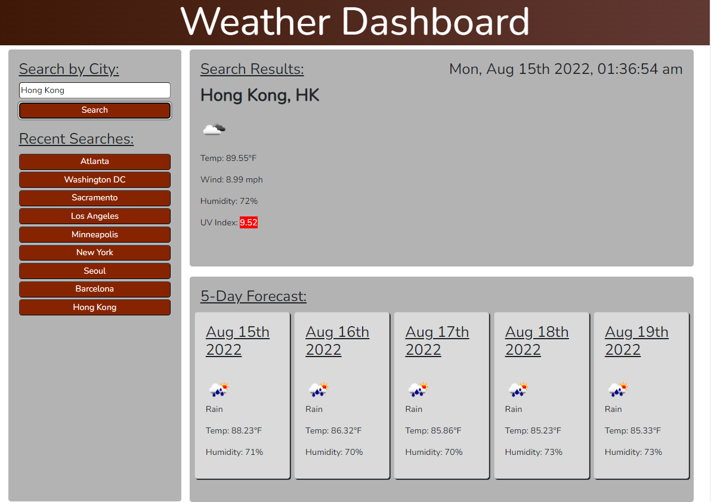

# Challenge 06:  Weather Dashboard using OpenWeatherMap API


```
By Vincent Yang
```

This application accepts user input using the search bar at the top right of the screen. Upon user search, the app will fetch weather data using OpenWeatherMap's API. to return the following:

* Current weather data for the searched city including temperature, wind speeds, humidity and UV index.
* 5-day Forecast for the searched city with basic weather data.

The application will save searches into local storage and create a list of recent searches below the search bar.

>Initial Landing Page
 


GitHub repository:

https://github.com/vyang14/weather-dashboard-openweathermap

Deployed application:

https://vyang14.github.io/weather-dashboard-openweathermap/